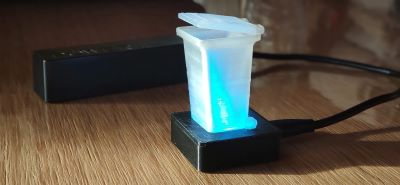
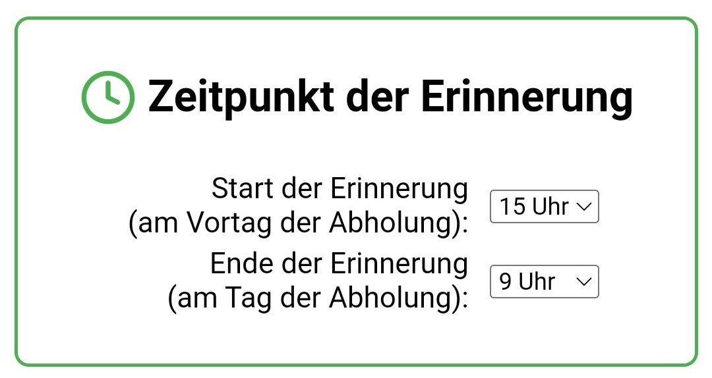
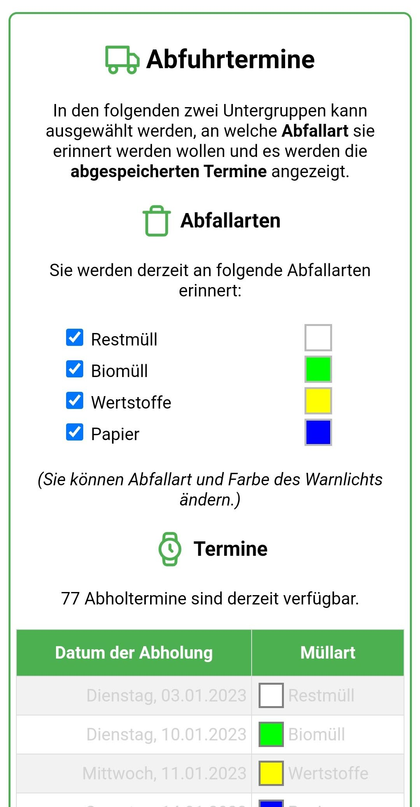
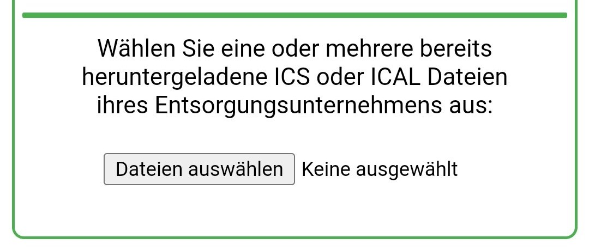
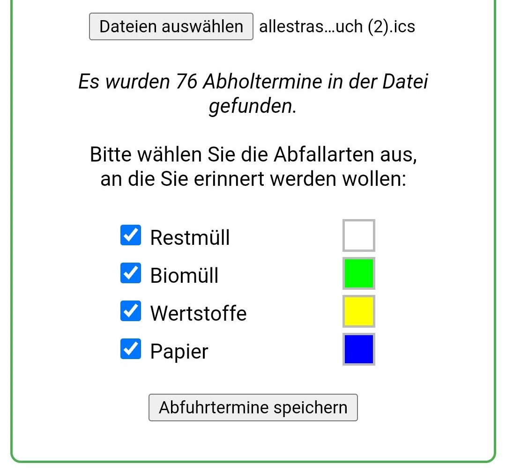

# Müll-Erinnerung ("Trash Reminder")

**Schon mal vergessen den Mülleimer rauszustellen?**

`Müll-Erinnerung` erinnert Dich daran, indem es eine farbig blinkende Erinnerung anzeigt.

Je nach Müllart blinkt das Mülleimermodell in einer unterschiedlichen Farbe:
- `weiß`: Restmüll
- `blau`: Papier
- `grün`: Biomüll/Häckselgut
- `gelb`: Gelber Sack oder Wertstofftonne

Wird also zum Beispiel `Restmüll` abgeholt, blinkt das Mülleimermodell `weiß`.

Sollten am selben Tag **zwei** unterschiedliche Müllarten abgeholt werden, wechselt das Licht zwischen den entsprechenden Farben hin und her. Also zum Beispiel zwischen `weiß` und `grün`, wenn sowohl `Restmüll` als auch `Biomüll` am selben Tag abgeholt werden.

## Einrichten der Müll-Erinnerung
Da das aktuelle Datum und Uhrzeit aus dem Internet ermittelt werden, muss die `Müll-Erinnerung` mit dem WLAN verbunden werden.

Wenn die `Müll-Erinnerung` zum ersten mal ans Netzteil angeschlossen wird, leuchetet das Mülleimermodell dauerhaft `rot` um mitzuteilen, dass die einmalige Einrichtung durchgeführt werden muss.

Hierzu muss man sich über das Smartphone mit dem WLAN Netzwerk `TrashReminder` verbinden und im folgenden Dialog
- Heimnetzwerk (SSID) auswählen und das
- Passwort für dieses Netzwerk eingeben.

Jetzt verbindet sich die `Müll-Erinnerung` mit dem ausgewählten Netzwerk und quittiert die erfolgreiche Verbindung mit einem `Feuerwerk` im Mülleimermodell.

Diese Einrichtung muss nur einmalig durchgeführt werden - von nun an holt sich die `Müll-Erinnerung` die aktuelle Uhrzeit aus dem Internet und gleicht diese mit eventuell vorliegenden Müllterminen ab, welche dann durch farbiges Blinken des Mülleimermodells mitgeteilt wird.

## Zeitpunkt der Erinnerung
Die Erinnerung erfolgt standardmäßig am **Vortag von 15 Uhr bis 9 Uhr morgens**. Diese Einstellung kann wie unter [Konfigurationsmodus](#konfigurationsmodus) beschrieben angepasst werden.

## Ausschalten der Erinnerung
Wenn der Müll rausgestellt wurde, kann die Erinnerung ausgeschaltet werden indem das **Mülleimermodell kurz angehoben** wird. Damit erlischt das Licht bis zur nächsten Abholerinnerung.

Wurde das Mülleimermodell versehentlich angehoben (aber der Müll nicht rausgestellt) kann man den Stecker der Stromversorgung einfach kurz aus- und wieder einstecken. Liegt eine Erinnerung vor und ist man im Erinnerungszeitraum (15 - 9 Uhr) blinkt das Mülleimermodell wieder wie zuvor.  

## Unterbrechung der WLAN Verbindung
Sollte es zu einer Verbindungsstörung zum Internet kommen, signalisiert die `Müll-Erinnerung` dies durch ein `schnelles rotes Blinken`. Man muss nichts weiter unternehmen - sobald die Verbindung wieder hergestellt werden kann wechselt die `Müll-Erinnerung` in den regulären Modus.

## Konfigurationsmodus
Um in den Konfigurationsmodus zu wechseln, muss das Mülleimermodell `dreimal angehoben` werden bis die LED dauerhaft `pink` leuchtet.
Jetzt kann über ein Smartphone oder einen Computer im Browser der Link [http://TrashReminder](http://TrashReminder) aufgerufen werden.
(In seltenen Fällen dauert es ein wenig, bis die Seite aufgerufen werden kann - in diesem Fall einfach die Seite erneut laden.)

Im Konfigurationsmodus können die folgenden Einstellungen für die `Müll-Erinnerung` vorgenommen werden:
- Start- und End-Uhrzeit der Erinnerung
- Abfallarten an die erinnert werden soll
- neue Abholtermine auf die `Müll-Erinnerung` laden

Außerdem werden die derzeit gültigen Abholtermine mit ihrer zugehörigen LED-Farbe angezeigt. Bereits verstrichene Termine werden ausgegraut dargestellt.

### Start- und End-Uhrzeit

Standardmäßig ist
- der Start der Erinnerung auf **15 Uhr** am Vortag der Abholung
- das Ende der Erinnerung auf **9 Uhr** am Tag der Abholung 
gesetzt.
Der jeweilige Zeitpunkt kann über das Auswahlfeld eingestellt werden und wird sofort auf die `Müll-Erinnerung` übertragen.

### Auswahl der Abfallarten

Für die abgespeicherten Abholtermine kann eingestellt werden an **welche Abfallarten** erinnert werden soll. Ebenso kann hier auch die Farbe des Warnlichts eingestellt werden.

Jede Änderung der Auswahl wird sofort auf die `Müll-Erinnerung` geladen und die jeweils ausgewählten Einzeltermine entsprechend angezeigt.  

### Neue Abholtermine speichern
Falls sich Änderungen an den Abfuhrterminen ergeben haben oder Termine für das nächste Jahr gespeichert werden sollen, könnnen im [Konfigurationsmodus](#konfigurationsmodus) neue Abfuhrtermine auf die `Müll-Erinnerung` geladen werden. Hierbei werden die bestehenden Daten überschrieben! Sollten noch keine Abfuhrtermine gespeichert sein oder keine zukünftigen Termine mehr anstehen, wechselt die `Müll-Erinnerung` (ab Version 2024) automatisch in den Konfigurationsmodus.

Die Abfuhrdaten werden üblicherweise durch das Entsorgungsunternehmen auf einer Webseite im ICS Format angeboten und müssen zuerst heruntergeladen werden.

#### Beispiele für Müllentsorger
Beispiele für Unternehmen, bei denen ICS Dateien heruntergeladen werden können:

- `Hirrlingen`: https://www.abfall-kreis-tuebingen.de/online-abfuhrtermine/
- `Hirrlingen (Bogenschütz)`: https://www.bogenschuetz-entsorgung.de/blaue-tonne-tuebingen/abfuhrtermine.html
- `Neuweiler/Böblingen`: https://www.lrabb.de/start/Service+_+Verwaltung/Abfuhrtermine.html
- `Stuttgart`: https://service.stuttgart.de/lhs-services/aws/abfallkalender
- `Ebhausen`: https://www.awg-info.de/privatkunden/abfuhrtermine
- `Rheinbach`: https://www.rsag.de/abfallkalender/abfuhrtermine
- `Holzgerlingen`: https://www.awb-bb.de/start/entsorgen/Abfuhrtermine.html
- `Hannover`: https://www.aha-region.de/abholtermine/abfuhrkalender

#### Übertragen neuer Termine

Sobald die ICS Datei auf das Handy oder den Computer heruntergeladen wurde, kann diese über den untenstehenden Button "Durchsuchen..." oder "Dateien auswählen" selektieren und auf die `Müll-Erinnerung` geladen werden. Es können auch mehrere Dateien ausgewählt werden, falls mehrere Unternehmen die Abfuhr übernehmen.

Nach der Auswahl der Dateien werden die gefundenen Abfuhrarten mit der standardmäßigen Farbe des Warnlichts angezeigt. An welche Abfallarten erinnert werden soll sowie die Farbe des Warnlichst kann hier angepaßt werden.

Über den Button "Abfuhrttermine speichern" können nun die Termine auf die `Müll-Erinnerung` geladen werden. 

#### Keine zukünftigen Termine vorhanden
Liegen keine zukünftigen Termine mehr vor, signalisiert die `Müll-Erinnerung` dies durch ein `schnelles pinkes Blinken` und geht automatisch in den Konfigurationsmodus.

### Beenden des Konfigurationsmodus
Durch erneutes dreimaliges Anheben des Mülleimermodells kann der Konfigurationsmodus wieder verlassen werden. Dies wird durch ein Feuerwerk im Mülleimermodell bestätigt.
Nach 10 Minuten wird der Konfiguratonsmodus automatisch beendet.

## Problem Behandlung
- [http://TrashReminder](http://TrashReminder) wird nicht gefunden:
  - Du bist nicht im [Konfigurationsmodus](#konfigurationsmodus).
  - Versuche den Link über den Laptop oder ein anderes Smartphone aufzurufen.
  - Versuche einen anderen Browser (manche Browser lassen Verbindungen nicht über `http://` zu)
  - Ermittle die IP-Adresse (192.168.178.x oder ähnlich) der `Müll-Erinnerung` und gib sie  in das Browser-Suchfeld ein.
    - Rufe deine Router-Konfiguration (z.B. [http://fritz.box](http://fritz.box)) auf und suche die IP eines Gerätes mit Namen `ESP...`. 
    - Benutze eine Smartphone App wie [Fing](https://play.google.com/store/apps/details?id=com.overlook.android.fing) und suche die IP eines Gerätes mit Namen `ESP...`.  

## Autor
Tobias Werner, Erfindungen aller Art
